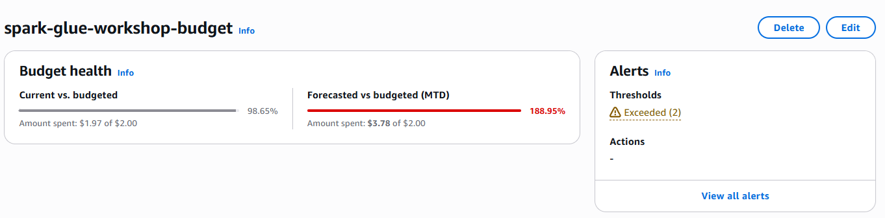
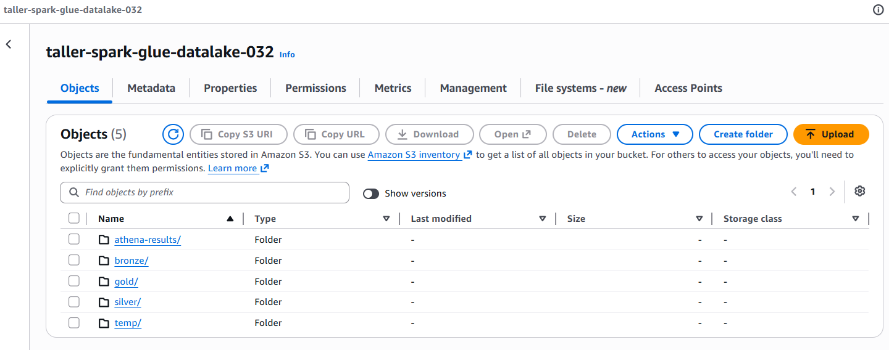
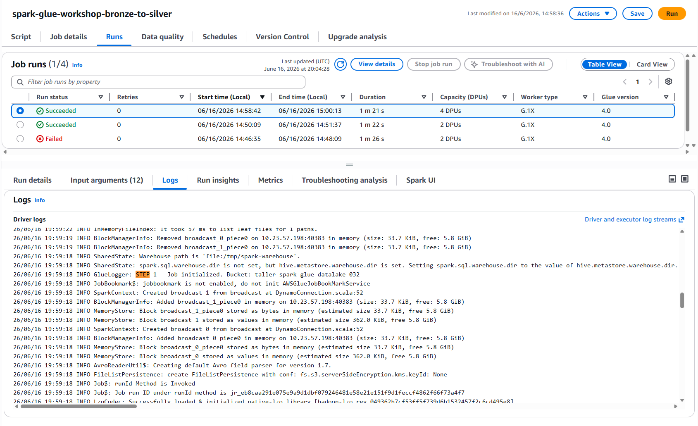
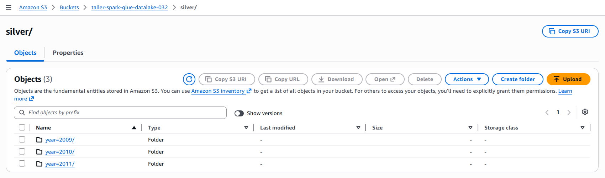

# Spark / AWS Glue Workshop

Pipeline ETL distribuido Bronze → Silver → Gold sobre el dataset Online Retail II,
construido con AWS Glue Studio, Step Functions y Athena.

## Evidencia del taller

### Step 0 — Alerta de presupuesto

- Se evidencia un consumo del _90%_ debido a que en mi cuenta personal se han estado utilizando otros servicios que no están relacionados con el diseño de esta implementación. Con esto, cualquier gasto inesperado durante el taller queda bajo control desde el primer minuto.

### Step 2 — Bucket S3 con las 5 carpetas

- Con esto, el Data Lake ya tiene su base: las cinco carpetas listas para recibir cada capa del pipeline.

### Step 5 — Job Bronze → Silver completado

- Con el job en Succeeded y las particiones por año visibles en silver/, se evidencia que la limpieza y el tipado funcionaron correctamente.

### Step 6 — Job Silver → Gold completado (modelo estrella)

- Con las cuatro tablas escritas en gold/, se evidencia que el modelo estrella quedó construido y listo para consultarse.
